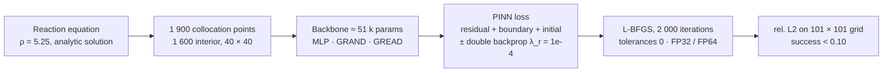

# Controlled Comparison of PDE-Structured Graph Backbones in Physics-Informed Neural Networks

A preregistered study of whether graph neural ODE backbones help physics-informed
neural networks (PINNs) escape the failure modes that the PINN literature reports on
its benchmark equations. Three backbones — a vanilla MLP and two graph neural ODEs
whose mixing layer is a learned diffusion (GRAND) or a learned diffusion-reaction
(GREAD) on a k-nearest-neighbour graph of the collocation points — are compared under
a single trainer at matched parameter count, with numerical precision and
regularisation as controlled factors. The study runs at the measured collapse edge of
the reaction equation, where the MLP baseline succeeds in about two of five seeds.

The design, the working point, the regularisation weight and the analysis were fixed
and hash-locked before the first run of the study matrix. The working point itself
was reached through a pilot on the convection equation that was stopped by its own
decision gate, a set of local feasibility diagnostics, and a stiffness sweep on the
reaction equation. This document describes the question, the framework, the results,
and the measurements behind each design decision.

**Headline results.** At the collapse edge (reaction, ρ = 5.25, 60 runs), the graph
backbones succeed far more often than the MLP: **GREAD in 18 of 20 runs, GRAND in
15 of 20, the MLP in 8 of 20.** Both graph backbones beat the MLP in all four
precision × regularisation strata, so the advantage does not vanish when those
factors are controlled. The preregistered mechanism did not hold: GRAND, which has no
reaction term, was predicted to gain nothing and gains nearly as much as GREAD. An
exploratory analysis locates the effect: most failures satisfy the PDE residual, the
boundary and the initial condition at the collocation points to a loss of 1e-5 and
are still wrong between them, and it is this failure mode that the graph backbones
avoid (MLP 9 of 20, GRAND 5, GREAD 2). Precision had no effect; double
backpropagation raised the success rate in every backbone. The comparison holds
parameters and iterations fixed, not compute: a graph run costs 10 to 16 times an MLP
run. The whole project used 10.2 of 27 available GPU-hours.

---

## 1. Question and design

**Question.** Does a PDE-structured backbone raise the probability that a PINN escapes
the collapse — and does such an advantage survive control for numerical precision and
regularisation?



**Working point.** The reaction equation of Krishnapriyan et al. (Appendix A),
u_t = ρ u (1 − u) on x ∈ [0, 2π], t ∈ [0, 1], periodic in x, with a Gaussian initial
profile of width π/4. Its analytic solution satisfies the residual to 1e-31, so the
target cannot be a source of error. ρ = 5.25 was chosen from MLP runs only — no graph
backbone had been run at this point — as the value where the baseline neither always
succeeds (ρ = 5) nor always collapses (ρ ≥ 6). Local runs gave 2 of 5 seeds (§4.3).

**Matrix.** 3 backbones × 2 precisions (FP32, FP64) × 2 regularisations (none, double
backpropagation) × 5 seeds = 60 runs, all on Kaggle Tesla T4 GPUs.

**Metrics.** Two co-primary metrics, both fixed before data: the success rate
(relative L2 < 0.10) with a Wilson 95 % interval, and the median log10(relative L2)
with a bootstrap percentile interval (10 000 resamples). The outcome was known to be
bimodal, which is why the success rate is co-primary; the median guards against a
classification that hinges on the third decimal. Divergence and NaN count as
relative L2 = 10 and are never excluded.

**Hypotheses.** H0: every architecture advantage disappears once precision and
regularisation are controlled. H1, the mechanistic prediction, was a contrast between
the two graph architectures: the reaction equation has no diffusion term, so GRAND
should gain nothing specific, while GREAD's reaction term should help. The protocol
stated in advance how to read the outcome: if both graph backbones win equally, that
argues against the mechanism and for a general benefit of graph mixing.

**Preregistration.** `PREREGISTRATION-V5.md`, frozen on 2026-09-22 (tag `prereg-v5`,
SHA-256 and freeze commit in `PREREGISTRATION-V5.lock.json`). The Kaggle launcher
refuses to build the matrix while the document is a draft or its hash differs from the
lock. Section 7 of the protocol states the power limit up front: with five seeds per
cell, even 2 of 5 against 5 of 5 gives a two-sided Fisher p ≈ 0.17, so single cells
carry no inference and the design detects only large effects at the backbone level.

## 2. Framework

### 2.1 Problems and reference solutions (`src/pdes/`)

| equation | form | reference | role |
|---|---|---|---|
| reaction | u_t = ρ u (1 − u), Gaussian initial profile | analytic, residual 1e-31 | stiffness sweep and main study |
| convection | u_t + β u_x = 0, periodic, u(x,0) = sin x | analytic | pilot, β = 50 |
| Allen–Cahn | u_t = 1e-4 u_xx + 5 u − 5 u³ | in-repo pseudo-spectral ETDRK4 solver, float64 | gated second stage of the pilot, not run |

Every problem exposes a resolution check that compares the collocation grid against
the wavenumber content of its reference solution, a precondition introduced after the
pilot (§4.1). The Allen–Cahn reference is generated in the repository
(`data/make_allen_cahn_reference.py`) and agrees with the Chebfun reference of the
original PINNs release to a relative L2 of 1.7e-5.

### 2.2 Backbones (`src/models/`)

All three map (x, t) to u and are sized to ≈ 50 k parameters: MLP 50 049, GRAND
51 301, GREAD 51 305.

**MLP.** Tanh multilayer perceptron, 4 × 128, the standard PINN baseline.

**Graph neural ODEs (GRAND, GREAD).** Collocation points form the nodes of a fixed
k-nearest-neighbour graph (k = 8, symmetrised, with self-loops) over the normalised
(x, t) domain. A linear encoder lifts each point to a hidden state, which is advanced
through explicit Euler steps of a learned PDE on the graph. Each step computes
attention scores between a node and its neighbours, aggregates the neighbour values
and takes the difference to the node's own value — a graph Laplacian with learned,
attention-based edge weights — scaled by a learned diffusivity. That is GRAND: pure
diffusion on the graph. GREAD adds a learned reaction term, an Allen–Cahn-type
nonlinearity tanh(h)(1 − tanh(h)²) with a learned rate, so that the mixing layer can
sharpen as well as smooth. A linear decoder reads out u. GRAND and GREAD differ only
in that reaction term.

**Fixed support.** All 1 900 collocation coordinates form one frozen context graph.
Every evaluation point queries this context through a fixed geometric radius with a
smooth, compactly supported distance weight, so that predictions and the automatic
derivatives the PDE residual needs are consistent between training and evaluation. An
earlier version let the context depend on the current query batch; local checks on
fresh seeds showed derivative deviations of at most 1.2e-9 after the change
(`docs/local-validation-v5.md`).

### 2.3 Trainer (`src/train.py`, `src/persistence.py`)

One trainer for every condition; separate training scripts per architecture are the
most common source of unfair comparisons in this literature. The optimiser is L-BFGS
with strong Wolfe line search, history 100, `max_eval = 25`, `tolerance_change =
tolerance_grad = 0` and a fixed iteration count. This is mandatory rather than
conventional: the precision confound identified in "FP64 is All You Need" (arXiv
2505.10949, §5.2) runs through L-BFGS's default `tolerance_change = 1e-7`, which sits
below FP32 machine epsilon, and disabling the tolerances is the only way to compare
FP32 and FP64 at equal training length. The optional regulariser is double
backpropagation (Andersen & Matsubara, arXiv 2605.30910), a penalty of weight λ_r on
the gradient of the residual, re-implemented in PyTorch from a JAX reference that
does not state its λ_r.

**Infrastructure.** Every run is written to SQLite the moment it terminates and
published as a new version of a private Kaggle dataset before the next run starts, so
a killed session loses at most the runs in flight. Runs resume from the database and
record source commit, Torch, CUDA and GPU. The study matrix runs as two worker
processes, one per T4; only the parent process writes the database and publishes. The
local 6 GB GPU is excluded from every study arm, because that would confound precision
with hardware.

## 3. Results

All 60 runs terminated normally on Kaggle Tesla T4 GPUs (31 on the first worker, 29
on the second), from a single source commit, with PyTorch 2.10.0 and CUDA 12.8. There
was no infrastructure failure and no repetition. Matrix wall-clock was 8.29 hours.
Raw data: `results/results.sqlite`; analysis: `analysis/v5_report.py` →
`results/v5_report.json`, written before the matrix data were seen.

### 3.1 Primary outcome

| backbone | successes | rate | Wilson 95 % | median log10(rel. L2) |
|---|---|---|---|---|
| MLP | 8 / 20 | 0.40 | [0.22, 0.61] | −0.53 |
| GRAND | 15 / 20 | 0.75 | [0.53, 0.89] | −1.17 |
| GREAD | 18 / 20 | 0.90 | [0.70, 0.97] | −1.22 |

By stratum (successes out of 5):

| precision / regularisation | MLP | GRAND | GREAD |
|---|---|---|---|
| FP32 / none | 2 | 3 | 4 |
| FP32 / double backprop | 2 | 5 | 5 |
| FP64 / none | 1 | 3 | 4 |
| FP64 / double backprop | 3 | 4 | 5 |

The two co-primary metrics agree on the ordering MLP < GRAND < GREAD; there is no
contradiction between them to report. Per-cell intervals and raw values per run are
in `results/v5_report.json` and `FINDINGS.md`.

### 3.2 Hypotheses

**H0 is not supported.** Both graph backbones beat the MLP in every stratum, eight of
eight comparisons, so the architecture advantage does not disappear under control
for precision and regularisation. Single strata carry no inference at n = 5; the
claim rests on the consistent direction and the pooled rates. Exploratory Fisher
tests on the pooled counts, two-sided and not preregistered: GREAD vs. MLP
p = 0.0022, GRAND vs. MLP p = 0.054. The Wilson intervals of GREAD and the MLP do not
overlap.

**The mechanistic prediction is not supported.** GRAND was predicted to gain nothing
and gains nearly as much as GREAD. By the reading fixed in advance, the reaction term
of GREAD is not shown to be what helps. GREAD ranks at or above GRAND in every stratum
and never below it, but 18 vs. 15 of 20 is not resolvable at this sample size
(Fisher p = 0.41, exploratory).

### 3.3 Precision and regularisation

| factor | successes |
|---|---|
| FP32 | 21 / 30 |
| FP64 | 20 / 30 |
| no regularisation | 17 / 30 |
| double backprop, λ_r = 1e-4 | 24 / 30 |

Precision has no effect. That is what the L-BFGS mechanism behind "FP64 is All You
Need" predicts once the tolerances are disabled: the precision effect runs through
the stopping criterion, and with none left there is nothing to transmit it. Double
backpropagation raises the success rate in every backbone (MLP 3 → 5, GRAND 6 → 9,
GREAD 8 → 10, out of 10 each). This was not a preregistered hypothesis and is reported
as a secondary observation.

### 3.4 How runs fail (exploratory)

This analysis was written after the matrix data had been seen
(`analysis/v5_failure_modes.py` → `results/v5_failure_modes.json`). The 19 failed
runs fall into two groups by their final training loss (the PINN loss without the
regulariser), three orders of magnitude apart:

| backbone | success | optimiser stalls | residual satisfied, solution wrong |
|---|---|---|---|
| MLP | 8 | 3 | 9 |
| GRAND | 15 | 0 | 5 |
| GREAD | 18 | 0 | 2 |

- **Optimiser stalls** (3 runs, all MLP, all FP32). From iteration 500 on the loss
  stays at 0.1994–0.1996 and the initial condition is never learned (initial term
  0.18). The line search spends 4.3–4.9 function evaluations per iteration instead of
  about 2. This is the optimisation collapse seen at ρ = 7 (§4.3).
- **Residual satisfied, solution wrong** (16 runs). The loss falls to 2.8e-6 –
  6.5e-5: residual, boundary and initial condition are met at the collocation points,
  and the relative L2 on the 101 × 101 evaluation grid is still 0.98–1.00 in eleven of
  them. The training loss does not distinguish these runs from the successful ones.

Two consequences follow. First, the description of the collapse edge as an
optimisation collapse, which motivated the working point, holds for only three of the
19 failures at ρ = 5.25; the dominant failure is a solution that is right at the
collocation points and wrong between them. Second, it is this failure mode that the
graph backbones reduce, from 9 of 20 to 5 and 2. That is consistent with the frozen
k-NN context acting as a coupling between neighbouring collocation points, which
makes pointwise-only solutions harder to reach; it does not establish that reading.
For PINN practice the observation is plain: at this working point a small training
loss is no evidence of a correct solution — 16 of 19 failures could not have been
detected from the loss alone.

### 3.5 Controls

- **Baseline gate.** The protocol required the MLP baseline (`mlp/fp32/none`) to stay
  within two seeds of the locally measured 2 of 5 before any other condition is
  interpreted. It reached exactly 2 of 5.
- **Determinism.** The cell `mlp/fp32/double_backprop` reproduced the two λ_r
  selection runs on seeds 3 and 4 (§4.5) to three decimals (0.096, 0.066): same
  hardware, same configuration, same result.
- **Hardware dependence of single seeds.** The baseline reached 2 of 5 on the T4 as
  on the CPU, but on different seeds (T4: seeds 2 and 4; CPU: 3 and 4). Rates
  reproduce across hardware, individual seed outcomes do not; seed-wise pairing across
  cells is therefore not used.
- **Threshold sensitivity.** Successes lie between 0.051 and 0.096; five of 60 values
  fall between 0.10 and 0.90, three of them just above the threshold (0.105, 0.116,
  0.142). A threshold of 0.12 would lift the MLP from 8 to 10 of 20 and leave the
  ordering unchanged. The threshold stays at the preregistered 0.10.

## 4. Design decisions and their measurements

The study above is the third protocol of the project. Each change of plan was either
forced by a measurement or taken by a recorded decision; the full list, with the
state of knowledge at the time of each change, is in `DEVIATIONS.md`.

### 4.1 The convection pilot and its gate (`results/gate_m2b.json`)

The first protocol (`PREREGISTRATION.md`, tag `prereg-v3`) targeted convection at
β = 50. Under a 5 GPU-hour budget, an outcome-blind budget hierarchy reduced the
collocation grid from 400 to 196 points. The first slice — six seed-0 cells, 6 000
L-BFGS iterations — produced a relative L2 between 1.21 and 2.31 in every cell, worse
than the zero predictor, at a residual loss of 1e-6 to 4e-4. That combination is the
signature of aliasing: sin(x − 50 t) has 7.96 periods in t ∈ [0, 1], and a 14 × 14
grid samples it at 1.75 points per period, below the Nyquist limit, so infinitely
many functions satisfy the residual on the grid. The preregistered gate ("at least
one cell < 0.10") failed and, by rule, no further budget was spent on that design.
The cause was a process failure — neither the protocol nor the execution contract
required a resolution check against the PDE parameter — and every problem now carries
one.

### 4.2 Feasibility diagnostics on convection (local CPU, not study data)

With resolved grids of 1 024 and 4 096 points, no configuration reached relative
L2 < 0.10 on convection β = 50 within the budgets tested; the best was 0.664. The
diagnostic suite (`analysis/diagnose_feasibility.py`) separated the causes. Capacity
is not the bottleneck: the same 4 × 128 MLP fits the analytic solution to 0.0113
under direct supervision. The physics loss is badly conditioned: at initialisation
the gradients of the domain and initial-condition terms have norms 63.9 and 2.15 and
a cosine of −0.993, so the two terms demand nearly opposite updates. Cold start
reproduces the literature (β = 1 and 10 solve, β = 50 does not); a curriculum helps
but does not suffice (0.634); double backpropagation shows a λ_r trade-off without
success. Convection at β = 50 was therefore saturated — every architecture fails —
and cannot separate backbones.

### 4.3 Finding the collapse edge (`results/reaction_*.json`, `results/edge_*.json`)

A stiffness sweep of the MLP on the reaction equation:

| ρ | domain points | best rel. L2 | |
|---|---|---|---|
| 1 | 1 600 | 0.0033 | solved |
| 3 | 1 600 | 0.0087 | solved |
| 5 | 400 | 0.981 | failed |
| **5** | **1 600** | **0.0575** | **solved** |
| 5.5 | 1 600 | 0.981 / 0.117 / 0.990 (seeds 0/1/2) | bimodal |
| 6 | 1 600 | 0.989 | failed |
| 7 | 1 600 | 0.993 | failed |
| 7 | 3 600 | 0.9998 | failed |
| 10 | 1 600 | 0.996 | failed |

Krishnapriyan et al. report ρ = 5 as a failure; with five collocation points across
the Gaussian initial profile instead of 2.5 it is not. The ρ = 7 control at 3 600
points separated two mechanisms: aliasing (small loss, wrong solution, cured by more
points) and optimisation collapse (loss stuck near 2e-1, not cured by more points).
The transition between solved and failed is sharp. ρ = 5.25, where five local seeds
gave 2 successes (final relative L2 0.996, 0.999, 0.109, 0.083, 0.070), became the
working point. §3.4 shows that at this working point the low-loss failure dominates,
not the collapse that the sweep emphasised.

### 4.4 Hardware and cost (`results/v5_gpu_profile_t4_*.json`)

A throw-away probe during the pilot compared a Kaggle P100 with 2× T4 before any study
data existed; the T4 was faster for this workload, and FP64 was faster than FP32 for
every backbone, because the problem is kernel-launch-bound and FP64 needed fewer
line-search evaluations. For the main study, the revised graph backbones were
profiled on 2× T4 before the freeze: GRAND/FP32 0.546 s and GREAD/FP64 with double
backprop 0.862 s per iteration, about 2.1 function evaluations per iteration. The
projection of ≈ 8 hours of session wall-clock for the matrix replaced an earlier
estimate of 7.4 hours that came from the superseded graph implementation; the
measured matrix time was 8.29 hours.

### 4.5 Choosing λ_r (`results/v5_lambda_selection.json`)

The protocol selects λ_r outcome-blind on the MLP only, from {1e-5, 1e-4, 1e-3,
1e-2}. The rule was first specified on seed 0. All four runs failed (relative L2
0.991–0.999), because seed 0 is one of the seeds on which the unregularised baseline
already fails; the rule would have picked λ_r = 1e-2 on noise. Before the freeze, and
with the project lead's decision recorded, the selection was moved to the two seeds
on which the baseline succeeds, selecting the lowest median relative L2:

| λ_r | median rel. L2 | seed 3 | seed 4 |
|---|---|---|---|
| 1e-5 | 0.105 | 0.126 | 0.084 |
| **1e-4** | **0.081** | 0.096 | 0.066 |
| 1e-3 | 0.104 | 0.130 | 0.077 |
| 1e-2 | 0.989 | 0.990 | 0.988 |

The discarded rule would have chosen the one value that destroys the solution. No
graph backbone had been run when the rule changed. Because λ_r was selected on two runs
of the `mlp/fp32/double_backprop` cell, it slightly favours the MLP baseline — that
is, it works against the graph advantage found, not for it (deviation D-13).

### 4.6 Freeze and provenance

The preregistration hash is taken over the LF-normalised bytes that Git stores and
that the Kaggle payload receives through `git show`. On the Windows working copy the
file carries CRLF line endings; a hash over those bytes would not have matched on
Kaggle and the launcher would have refused to start. `bench/freeze_v5.py` hashes the
canonical form and verifies it against the committed blob, and a test covers the
case. The code payload for every Kaggle run is built from a clean commit and carries
a manifest with the SHA-256 of every file, which the notebook checks before it runs.

### 4.7 Budget

| phase | allocated (GPU-h) | spent | state |
|---|---|---|---|
| calibration, P100 vs. 2× T4 | 0.5 | 0.54 | closed |
| convection pilot slice | 2.0 | 0.94 | stopped by gate |
| follow-up profiling and overhead | — | 0.19 | closed |
| λ_r selection | 1.5 | 0.26 | complete |
| main matrix, 60 runs | 10.0 | 8.29 | complete |
| reserve | 1.0 | 0 | untouched |
| **total** | **27.0** | **10.2** | |

The original full design — convection and Allen–Cahn, with and without double
backprop — would have needed ≈ 62 GPU-hours (`BUDGET.md`), about twelve times the
budget granted at the time.

### 4.8 Corrections to earlier statements

- The collapse edge was described as an optimisation collapse; at ρ = 5.25 that holds
  for three of 19 failures (§3.4).
- The claim that L-BFGS was standing still in this project was wrong: a missing
  `max_eval` in a diagnostic script, not in the trainer.
- The first execution of the pilot gate check read a censoring flag instead of the
  metric; the reported values come from the corrected script.
- The four-samples-per-period resolution rule is a conservative project rule, not a
  solvability law established by the reference paper, which itself uses a 20 × 20
  grid.
- A 3 000-second per-cell timeout on Kaggle, inferred from one cancelled pilot run
  with an empty log, did not exist; the limit is the 12-hour session (D-11).

## 5. Limitations

- **Equal iterations, not equal compute.** Parameters and iterations are matched,
  wall-clock is not: a graph run cost 1 069–1 633 s, an MLP run 69–151 s. Whether an
  MLP given the same compute catches up is untested.
- **Which part of the graph backbone helps is open.** GRAND and GREAD share the frozen
  k-NN context; that both gain points to it rather than to the reaction term, and
  §3.4 suggests how, but an ablation that keeps the context and removes both the
  diffusion and the reaction term has not been run.
- **One working point.** One equation, one ρ, one network size, one graph topology
  (k = 8), one iteration budget. The convection pilot is saturated and the Allen–Cahn
  stage was never run, so nothing is claimed about either.
- **Five seeds per cell.** Single cells and single strata carry no inference; the
  results are backbone-level rates over 20 runs, and the GREAD–GRAND difference is
  not resolved.
- **Exploratory analyses are labelled as such.** The Fisher tests and the
  failure-mode analysis (§3.4) were not preregistered.
- **A re-implementation.** The double-backprop reference uses JAX/Optax and does not
  state its λ_r; this is a PyTorch re-implementation, not an exact reproduction.
- Early pilot runs stored `git_commit = unknown` and did not persist the hardware;
  every run of the main study records both.

## 6. Reproduction

```bash
pip install -e .                             # numpy, scipy, torch >= 2.6; Python >= 3.11
python -m unittest discover -s tests -v      # 68 tests, CPU only
python -m src.train --config configs/smoke.json   # 200 L-BFGS iterations, writes a real SQLite row
python -m analysis.v5_report --study-id reaction_v5_rho525_20260922     # §3.1–3.3
python -m analysis.v5_failure_modes --study-id reaction_v5_rho525_20260922   # §3.4
```

The analysis commands read `results/results.sqlite`, which holds every run of the
project including failures. Kaggle notebooks are generated, not hand-written:
`kaggle/build_v5_payload.py` builds the code payload from a clean commit,
`kaggle/build_notebook.py` generates the launcher, and `kaggle/v5_runner.py` resumes
from the database and publishes after every terminal run. `bench/freeze_v5.py` froze
the protocol.

## 7. Repository layout

| Path | Content |
|---|---|
| `src/pdes/` | reaction, convection, Allen–Cahn with reference solutions; resolution check |
| `src/models/` | MLP; GRAND and GREAD graph neural ODE backbones with fixed-support context |
| `src/train.py`, `src/persistence.py` | the single trainer; SQLite attempts and resume |
| `bench/` | study matrix, λ_r conditions, protocol freeze, calibration, budget planning, feasibility anchors |
| `kaggle/` | payload builder, notebook generator, two-worker runner, fail-closed publication |
| `analysis/` | study report, failure modes, λ_r selection, GPU profile, pilot gate, feasibility diagnostics |
| `results/` | `results.sqlite` (every run, including failures) and JSON artefacts |
| `tests/` | 68 unit tests |
| `PREREGISTRATION-V5.md`, `PREREGISTRATION-V5.lock.json` | main study protocol, frozen and hash-locked |
| `PREREGISTRATION.md`, `PREREGISTRATION-V4.md` | pilot protocol (frozen); superseded draft, never run |
| `DEVIATIONS.md` | every deviation from the literature and from a frozen plan, with reasons |
| `FINDINGS.md`, `BUDGET.md`, `HANDOFF.md` | findings in German, quota ledger, handover state |
| `docs/` | baseline definitions from seven full texts, gate rules, execution contract, local validation |

## 8. Data, licences and provenance

Code and documentation: MIT. No external data is used by the main study; the
reaction reference is analytic. `data/allen_cahn.mat` is generated in-repository by
`data/make_allen_cahn_reference.py` (Fourier pseudo-spectral, ETDRK4, float64) and
agrees with the Chebfun reference of the original PINNs release (Raissi et al., MIT)
to a relative L2 error of 1.7e-5. Until 2026-09-18 the file was a copy from
`miniHuiHui/PINN_FP64` (Xu et al. 2025), a repository without a licence, and an
earlier version of this section misattributed it to Raissi et al.; see D-10 in
`DEVIATIONS.md` and `data/README.md`. Sources read in full for the baseline
definitions: Krishnapriyan et al. 2021 (arXiv 2109.01050), PINNsformer (2307.11833),
GRAND (2106.10934), GREAD (2211.14208), "FP64 is All You Need" (2505.10949), Andersen
& Matsubara 2026 (2605.30910), Expert's Guide to PINNs (2308.08468).

Developed by one person over five weeks with AI coding agents (Claude, OpenAI Codex)
under a written brief: protocol frozen before any study run, outcome-blind budget
cuts, no cherry-picking, and a stop-and-report at every gate. The working documents
record the process history, including the occasions on which the project lead
reversed an earlier decision.

## 9. Citation

```bibtex
@software{pinn_graph_backbones_2026,
  title  = {Controlled Comparison of PDE-Structured Graph Backbones in Physics-Informed Neural Networks},
  author = {Say43},
  year   = {2026},
  url    = {https://github.com/Say43/PINN}
}
```
